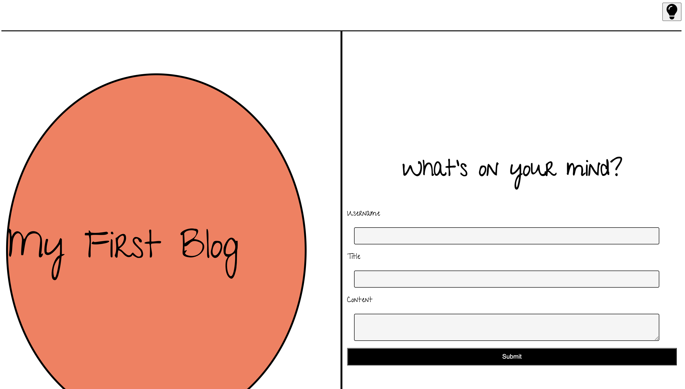
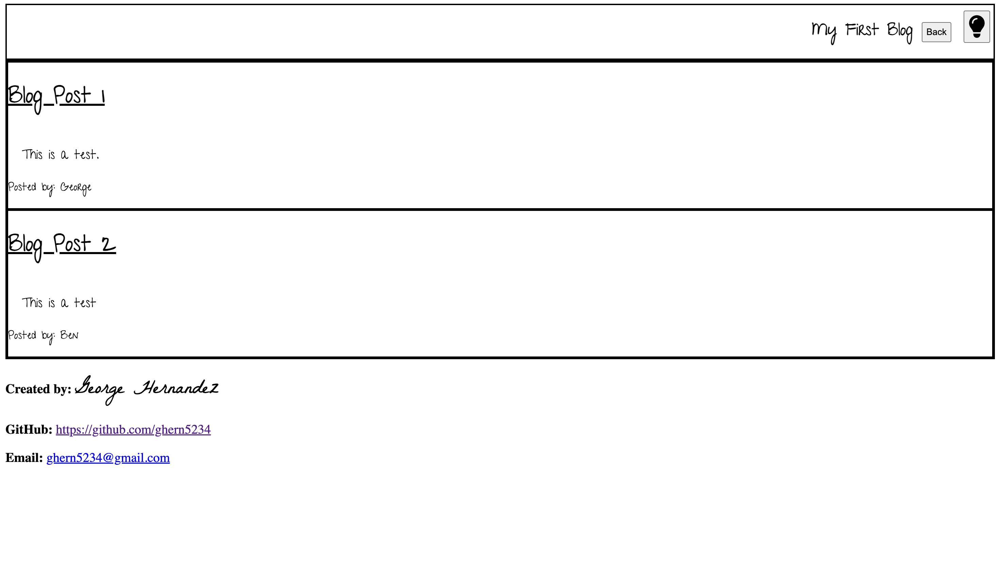

# personal-blog

## Description

- The motivation behind this prject was to create a blog post application that stored the user's input information to local storage, then pull that data in a seperate page to dynamically create and display the user's input in a blog list format. The page's needed to have functioning submit and back buttons, as well as a toggle button to change the themes of the pages.

- Working on this project really tied everything together that we have learned about HTML, CSS and JavaScript. Understanding how to dynamically create elements really began to show me the power of JavaScript. This project was challenging but also very fun to create. 

